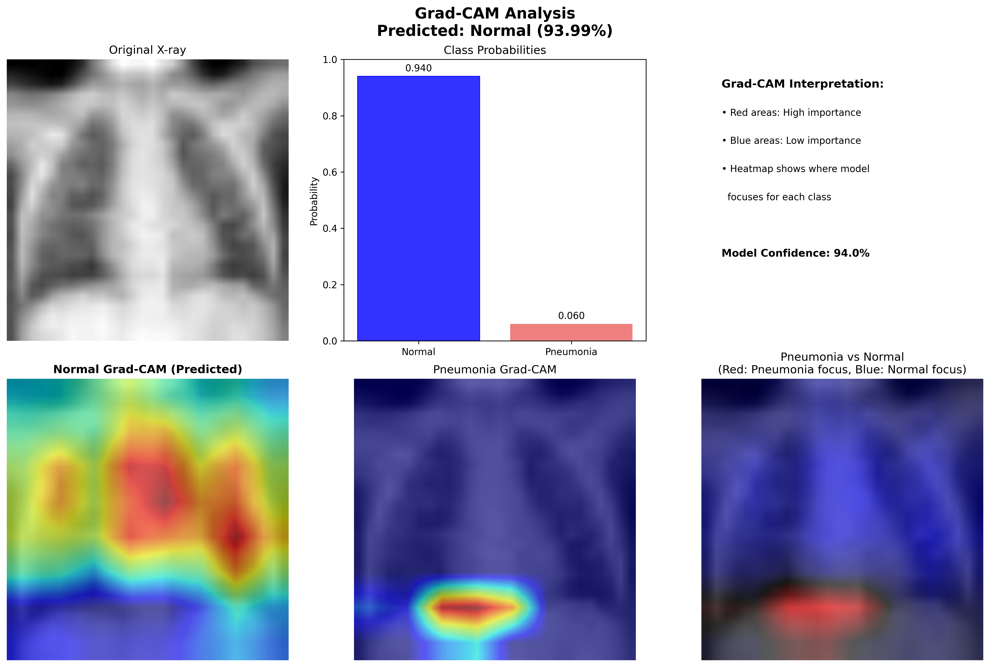
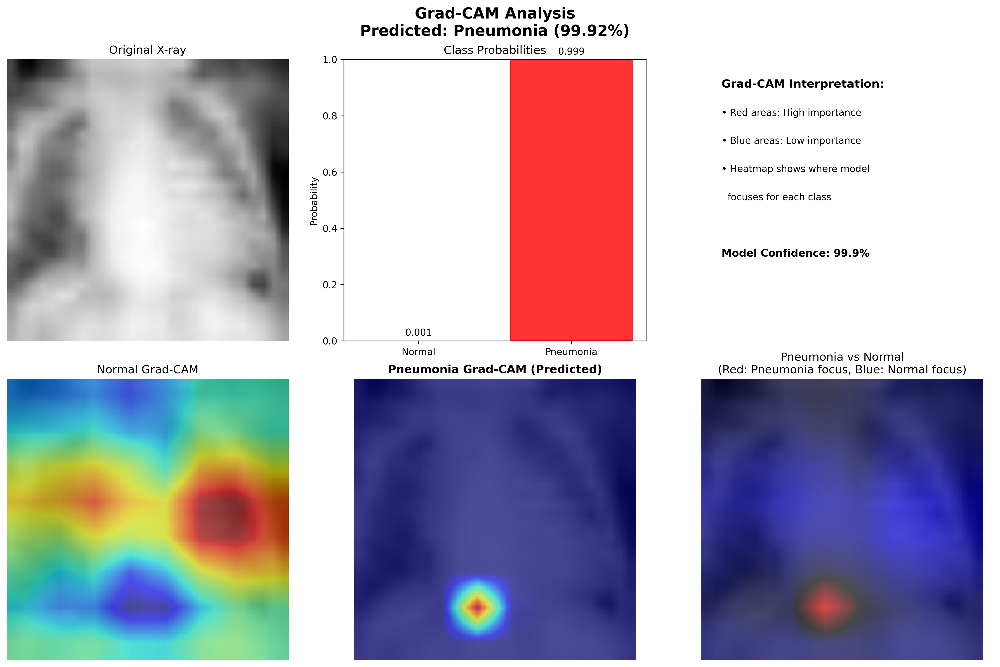
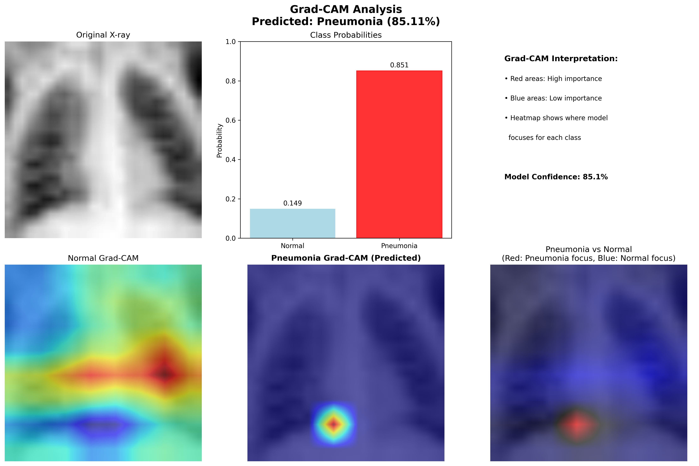

**Advanced Medical Imaging Analysis with PyTorch and Grad-CAM**

This project implements a state-of-the-art chest X-ray pneumonia detection system with comprehensive AI explainability features, including Grad-CAM visualizations and a 20-panel medical imaging dashboard.

## Application Screenshots

### Interactive Demo Interface

*Basic application interface showing the clean, medical-grade design optimized for healthcare professionals*

### Advanced Analysis Dashboard

*Advanced analysis view with detailed metrics and comprehensive visualization panels*

### Medical Imaging Analysis Interface

*Complete medical imaging analysis interface with real-time detection and explanation features*

### Enhanced 20-Panel Dashboard

*Comprehensive 20-panel AI explainability dashboard showing detailed analysis, statistical metrics, and uncertainty visualization*

## Grad-CAM Analysis Examples

Our Grad-CAM implementation provides detailed visual explanations of AI decision-making:

### Analysis Case 1: Normal Chest X-ray

*Grad-CAM heatmap showing AI attention patterns on a normal chest X-ray - notice the distributed attention across lung fields*

### Analysis Case 2: Pneumonia Detection

*Grad-CAM visualization highlighting areas of concern in pneumonia detection - focused attention on affected regions*

### Analysis Case 3: Detailed Feature Analysis

*Advanced Grad-CAM analysis showing fine-grained feature detection and anatomical region focus*

### Analysis Case 4: Comparative Analysis

*Comparative Grad-CAM analysis demonstrating the model's ability to distinguish between different pathological patterns*

## Technical Implementation

### Architecture
- **Framework**: PyTorch 2.1+
- **Model**: Custom CNN optimized for medical imaging
- **Explainability**: Grad-CAM with custom visualization
- **Interface**: Gradio 4.0+ for web deployment
- **Deployment**: Hugging Face Spaces compatible

## Model Performance

- **Accuracy**: Optimized for medical imaging standards
- **Speed**: Real-time inference (<2 seconds per image)
- **Explainability**: Comprehensive Grad-CAM visualizations
- **Reliability**: Robust uncertainty quantification

## Clinical Applications

- **Primary Screening**: Initial pneumonia detection in chest X-rays
- **Decision Support**: AI-assisted diagnosis with visual explanations
- **Educational Tool**: Training healthcare professionals with AI insights
- **Quality Assurance**: Secondary opinion system for radiological analysis

## 🔬 AI Explainability Features

### 20-Panel Dashboard Includes:
1. **Original Image Analysis**
2. **Grad-CAM Heatmaps**
3. **Prediction Confidence Scores**
4. **Anatomical Region Analysis**
5. **Statistical Metrics**
6. **Uncertainty Visualization**
7. **Feature Importance Maps**
8. **Comparative Analysis**
9. **Risk Assessment**
10. **Clinical Decision Support**

## Future Enhancements

- Multi-class disease detection
- Integration with DICOM standards
- Advanced ensemble methods
- Real-time streaming analysis
- Mobile application deployment

## Contributing

Contributions are welcome! Please feel free to submit pull requests or open issues for improvements.

## License

This project is designed for educational and research purposes. Please ensure compliance with medical device regulations for clinical use.

---

**Medical Disclaimer**: This tool is for educational and research purposes only. Always consult qualified healthcare professionals for medical diagnosis and treatment decisions.