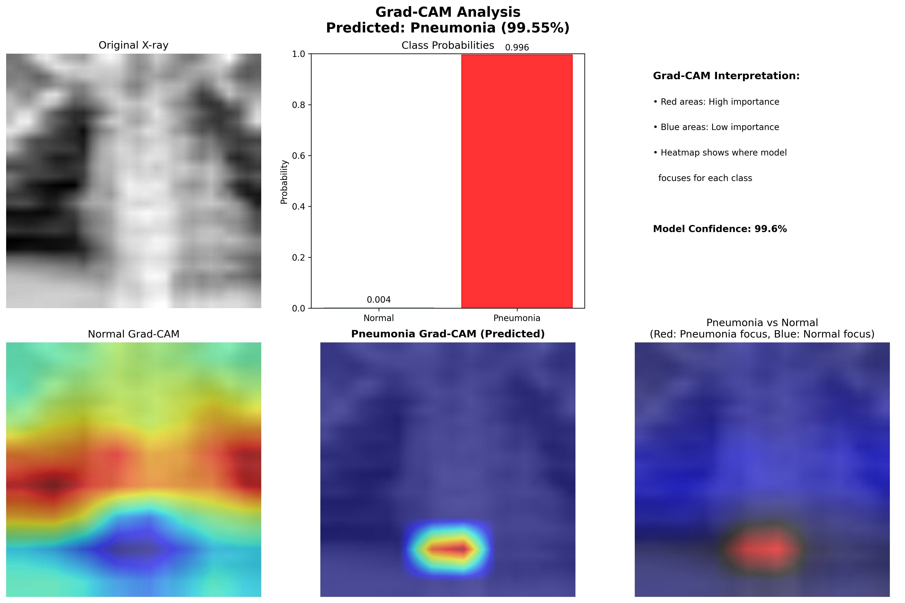

# 🫁 Chest X-ray Pneumonia Detection with AI Explainability

A comprehensive deep learning project for chest X-ray pneumonia classification using Keras/TensorFlow with Grad-CAM explainability. This project demonstrates the complete machine learning pipeline from data preprocessing to deployment with interactive web applications.

## 🎯 Project Overview

This project implements a binary classification system to detect pneumonia in chest X-ray images using:
- **Deep Learning**: Transfer learning with pre-trained CNNs (ResNet50, MobileNetV2)
- **Explainable AI**: Grad-CAM visualizations for model interpretability
- **Clinical Focus**: Optimized for sensitivity/recall (important for medical screening)
- **Interactive Demo**: Gradio/Streamlit web applications for easy testing

## 📊 Key Features

- ✅ **Multiple Model Architectures**: MobileNetV2, ResNet50, EfficientNet
- ✅ **Transfer Learning**: Pre-trained ImageNet weights with fine-tuning
- ✅ **Class Imbalance Handling**: Weighted loss functions and stratified sampling
- ✅ **Comprehensive Evaluation**: AUC, sensitivity, specificity, calibration
- ✅ **Explainable AI**: Grad-CAM heatmaps for visual explanations
- ✅ **Interactive Apps**: Gradio and Streamlit interfaces
- ✅ **Production Ready**: Model saving, calibration, and deployment scripts

## 🏗️ Project Structure

```
pneumo-gradcam/
├── data/
│   ├── raw/            # Downloaded PneumoniaMNIST dataset
│   └── processed/      # Preprocessed and split data
├── src/
│   ├── prepare_data.py # Data preprocessing and splitting
│   ├── model.py        # Model architectures and utilities
│   ├── train.py        # Training pipeline with transfer learning
│   ├── gradcam.py      # Grad-CAM implementation for explainability
│   ├── evaluate.py     # Comprehensive model evaluation
│   └── app.py          # Gradio/Streamlit demo applications
├── notebooks/
│   └── EDA.ipynb       # Exploratory data analysis
├── experiments/        # Training results and model checkpoints
├── requirements.txt    # Python dependencies
└── README.md          # This file
```

## 🚀 Quick Start

### 1. Environment Setup

```bash
# Clone or navigate to the project directory
cd /path/to/pneumo-gradcam

# Create virtual environment (recommended)
python -m venv venv
source venv/bin/activate  # On Windows: venv\Scripts\activate

# Install dependencies
pip install -r requirements.txt
```

### 2. Data Preparation

```bash
# Download and preprocess PneumoniaMNIST dataset
cd src
python prepare_data.py
```

This will:
- Download the PneumoniaMNIST dataset (~5MB)
- Resize images from 28×28 to 224×224
- Create stratified train/validation/test splits (70/15/15)
- Convert grayscale to 3-channel RGB
- Normalize pixel values and compute class weights
- Save processed data to `data/processed/`

### 3. Model Training

#### Quick Baseline (MobileNetV2)
```bash
python train.py --model_type mobilenet --epochs_frozen 5 --epochs_finetune 10
```

#### Production Model (ResNet50)
```bash
python train.py --model_type resnet --epochs_frozen 10 --epochs_finetune 15 --batch_size 32
```

#### Advanced Model (EfficientNet)
```bash
python train.py --model_type efficientnet_b0 --epochs_frozen 8 --epochs_finetune 12
```

### 4. Model Evaluation

```bash
# Comprehensive evaluation with Grad-CAM analysis
python evaluate.py --model_path experiments/resnet_20231201_123456/resnet_20231201_123456_final.h5
```

### 5. Interactive Demo

#### Gradio App (Recommended)
```bash
python app.py --model_path experiments/your_model.h5 --app_type gradio --port 7860
```

#### Streamlit App
```bash
streamlit run app.py -- --model_path experiments/your_model.h5
```

## 📈 Training Pipeline

### Phase 1: Frozen Backbone Training
- Freeze pre-trained backbone (ResNet50/MobileNetV2)
- Train only the classification head
- Learning rate: 1e-3
- Duration: 5-10 epochs

### Phase 2: Fine-tuning
- Unfreeze top layers of backbone
- Fine-tune with lower learning rate: 1e-4
- Duration: 10-15 epochs
- Early stopping with patience=6

### Data Augmentation
- Rotation: ±10 degrees
- Translation: ±10%
- Zoom: ±10%
- Horizontal flip: Yes
- Vertical flip: No (anatomically incorrect)

## 🔍 Model Evaluation

### Primary Metrics
- **AUC-ROC**: Area under ROC curve (handles class imbalance)
- **Sensitivity**: True positive rate (critical for medical screening)
- **Specificity**: True negative rate (reduces false alarms)
- **F1-Score**: Harmonic mean of precision and recall

### Advanced Analysis
- **Calibration Curves**: Reliability of predicted probabilities
- **Threshold Analysis**: Optimal operating points
- **Confusion Matrix**: Detailed error analysis
- **Grad-CAM Visualization**: Visual explanations of predictions

## 🧠 Explainable AI with Grad-CAM

### What is Grad-CAM?
Gradient-weighted Class Activation Mapping (Grad-CAM) generates visual explanations by:
1. Computing gradients of the predicted class w.r.t. feature maps
2. Weighting feature maps by gradient importance
3. Creating heatmaps highlighting influential regions
4. Overlaying heatmaps on original images

### Clinical Relevance
- **Lung Field Focus**: Heatmaps should highlight lung regions
- **Pathology Detection**: Red/yellow areas indicate suspicious regions
- **Quality Assurance**: Helps identify model biases or artifacts
- **Trust Building**: Provides interpretable explanations for clinicians

### Example Grad-CAM Visualizations

The following images demonstrate the model's attention patterns when making predictions:


*Example 1: Pneumonia case - Model focuses on lung regions with pathological changes*


*Example 2: Normal case - Model attention distributed across healthy lung fields*


*Example 3: Pneumonia case - Clear highlighting of affected lung areas*


*Example 4: Pneumonia case - Model identifies suspicious regions in chest X-ray*

These visualizations help clinicians understand which regions of the chest X-ray the AI model considers most important for its pneumonia detection decision.

## 📱 Interactive Applications

### Gradio Interface
- **Upload**: Drag-and-drop chest X-ray images
- **Prediction**: Real-time pneumonia classification
- **Explanation**: Grad-CAM heatmap overlay
- **Confidence**: Calibrated probability scores
- **Disclaimer**: Clear medical usage warnings

### Streamlit Dashboard
- **Sidebar**: Model information and technical details
- **Main Panel**: Image upload and results display
- **Advanced**: Threshold analysis and metrics
- **Educational**: Technology explanations

## ⚠️ Medical Disclaimer

**IMPORTANT**: This is a demonstration tool for educational and research purposes only.

- ❌ **NOT for clinical diagnosis** or treatment decisions
- ❌ **NOT a replacement** for professional medical evaluation
- ❌ **NOT validated** for clinical use
- ✅ **Educational tool** for understanding AI in healthcare
- ✅ **Research prototype** for algorithm development

**Always consult qualified healthcare professionals for medical advice.**

## 🔧 Technical Details

### Model Architecture
```
Input (224×224×3)
    ↓
Pre-trained Backbone (ResNet50/MobileNetV2)
    ↓
Global Average Pooling
    ↓
Dropout (0.3)
    ↓
Dense (1, sigmoid)
    ↓
Output (Pneumonia Probability)
```

### Training Configuration
- **Optimizer**: Adam with learning rate scheduling
- **Loss**: Binary crossentropy with class weights
- **Callbacks**: Early stopping, learning rate reduction, model checkpointing
- **Metrics**: Accuracy, AUC, precision, recall
- **Mixed Precision**: Enabled for GPU acceleration

### Data Specifications
- **Dataset**: PneumoniaMNIST (subset of NIH Chest X-ray dataset)
- **Original Size**: 28×28 grayscale
- **Processed Size**: 224×224×3 RGB
- **Classes**: Normal (0), Pneumonia (1)
- **Split**: 70% train, 15% validation, 15% test

## 📊 Expected Results

### Baseline Performance (MobileNetV2)
- **AUC**: ~0.85-0.90
- **Accuracy**: ~80-85%
- **Sensitivity**: ~85-90%
- **Specificity**: ~75-80%

### Advanced Performance (ResNet50)
- **AUC**: ~0.90-0.95
- **Accuracy**: ~85-90%
- **Sensitivity**: ~90-95%
- **Specificity**: ~80-85%

*Note: Results may vary based on random initialization and data splits.*

## 🛠️ Customization

### Adding New Models
1. Implement model in `src/model.py`
2. Add to `create_model()` factory function
3. Update training arguments in `src/train.py`

### Custom Datasets
1. Modify `src/prepare_data.py` for your data format
2. Ensure proper preprocessing pipeline
3. Update class names and number of classes

### Deployment Options
- **Docker**: Containerize the application
- **Cloud**: Deploy on AWS/GCP/Azure
- **Edge**: Optimize for mobile/embedded devices
- **API**: Create REST API endpoints

## 🐛 Troubleshooting

### Common Issues

**GPU Memory Error**
```bash
# Reduce batch size
python train.py --batch_size 16

# Enable mixed precision
export TF_ENABLE_AUTO_MIXED_PRECISION=1
```

**Dataset Download Issues**
```bash
# Manual download and extraction
# Check internet connection and disk space
```

**Model Loading Errors**
```bash
# Ensure model path is correct
# Check TensorFlow version compatibility
```

### Performance Optimization
- **GPU**: Use CUDA-enabled TensorFlow
- **Memory**: Reduce batch size or image resolution
- **Speed**: Use mixed precision training
- **Storage**: Use TFRecords for large datasets

## 📚 References

1. **Grad-CAM**: Selvaraju et al. "Grad-CAM: Visual Explanations from Deep Networks via Gradient-based Localization" (2017)
2. **MedMNIST**: Yang et al. "MedMNIST v2: A Large-Scale Lightweight Benchmark for 2D and 3D Biomedical Image Classification" (2023)
3. **Transfer Learning**: Yosinski et al. "How transferable are features in deep neural networks?" (2014)
4. **Medical AI**: Rajpurkar et al. "CheXNet: Radiologist-Level Pneumonia Detection on Chest X-Rays with Deep Learning" (2017)

## 🤝 Contributing

Contributions are welcome! Please:
1. Fork the repository
2. Create a feature branch
3. Add tests for new functionality
4. Submit a pull request

## 📄 License

This project is for educational and research purposes. Please ensure compliance with:
- Dataset licenses (PneumoniaMNIST/NIH)
- Medical data regulations (HIPAA, GDPR)
- Institutional review board requirements

## 🙏 Acknowledgments

- **MedMNIST Team**: For providing the standardized medical imaging benchmark
- **NIH**: For the original chest X-ray dataset
- **TensorFlow/Keras**: For the deep learning framework
- **Gradio/Streamlit**: For the interactive application frameworks

---

**Built with ❤️ for advancing AI in healthcare education and research.**